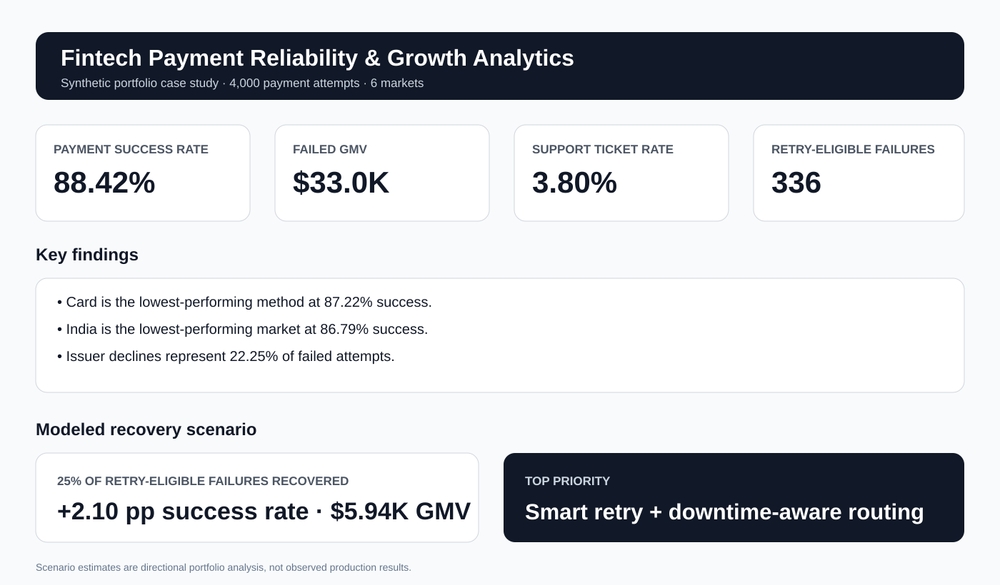

# Fintech Payment Reliability & Growth Analytics

**Strategy & Operations · Product · Business Analytics · Fintech Operations**

A portfolio case study that investigates where payment failures create customer friction and revenue leakage, then turns the analysis into prioritized product/operations interventions, KPI definitions, decision gates, and a 90-day roadmap.

> **Disclosure:** This project uses a **synthetic dataset** generated for portfolio demonstration. No proprietary company, merchant, or customer data is used. Scenario estimates are directional and are not production outcomes.



## Executive summary

I analyzed **4,000 synthetic payment attempts across 6 markets** to answer one business question:

> **Where are payment failures creating the most customer friction and revenue leakage, and which interventions should be prioritized first?**

### Key findings

| KPI / finding | Result |
|---|---:|
| Payment attempts | 4,000 |
| Overall payment success rate | **88.42%** |
| Failed GMV | **$33,003.92** |
| Support-ticket rate | **3.80%** |
| Lowest-performing payment method | **Card — 87.22%** |
| Lowest-performing market | **India — 86.79%** |
| Largest failure category | **Issuer decline — 22.25% of failures** |
| 25% retry-recovery scenario | **+2.10 pp success-rate lift** |
| Modeled GMV recovered in scenario | **$5,936.49** |

## Recommended priorities

1. **Smart retry + downtime-aware routing** — target transient issuer/gateway failures and instrument recovered GMV and success-rate lift.
2. **Failure-specific customer messaging** — reduce repeat failures and support demand with actionable authentication/detail/funds messaging.
3. **Merchant integration quality checks** — identify configuration issues before production and track integration-health KPIs.
4. **Market/method monitoring and alerts** — establish operating thresholds for acceptance deterioration and systemic downtime.

## Prioritization approach

The analysis uses a RICE-style decision model: **Reach × Impact × Confidence ÷ Effort**. The highest-value actions are translated into a 90-day operating roadmap:

- **Weeks 1–2 — Diagnose:** baseline metrics, failure taxonomy, segment analysis
- **Weeks 3–4 — Design:** requirements, retry rules, messaging, alert thresholds
- **Weeks 5–8 — Pilot:** controlled rollout with success/revenue/support guardrails
- **Weeks 9–12 — Scale:** dashboards, operating playbooks, monitoring, scale decision

## Repository structure

```text
.
├── README.md
├── CASE_STUDY.md
├── requirements.txt
├── analysis/
│   ├── generate_dataset.py
│   └── payment_analysis.py
├── data/
│   └── README.md
├── outputs/
│   └── summary_metrics.csv
├── portfolio/
│   ├── initiative_prioritization.csv
│   ├── 90_day_roadmap.csv
│   └── stakeholder_plan.md
└── assets/
    └── dashboard.svg
```

## Reproduce the analysis

```bash
python -m venv .venv
source .venv/bin/activate        # Windows: .venv\Scripts\activate
pip install -r requirements.txt
python analysis/generate_dataset.py
python analysis/payment_analysis.py
```

The generator uses a fixed random seed, so it reproduces the same 4,000-row synthetic dataset and headline metrics.

## What the dataset captures

- market and merchant segment
- new vs. returning customer
- payment method and transaction value
- success/failure status
- failure source and reason
- retry eligibility
- latency
- support-ticket creation

## Skills demonstrated

- Structured problem framing
- Secondary research
- Data-driven decision making
- Segmentation and KPI definition
- Revenue leakage analysis
- Process improvement
- Requirements thinking
- Initiative prioritization
- Roadmap planning
- Risk/decision gates
- Stakeholder-ready communication

## Public research references

- Stripe — card declines: https://docs.stripe.com/declines/card
- Stripe — acceptance analytics: https://docs.stripe.com/payments/analytics/acceptance
- Razorpay — payment errors: https://razorpay.com/docs/errors/
- Razorpay — success-rate analytics: https://razorpay.com/docs/payments/payments/success-rate-analytics/
- Razorpay — payment downtime: https://razorpay.com/docs/payments/payments/downtime-updates/

## Interview discussion points

- How do you use data to prioritize product or operations work?
- Which KPI would you optimize first, and why?
- How would you distinguish customer, merchant, issuer, and gateway failures?
- How would you validate whether a retry intervention is genuinely incremental?
- What guardrails would you use before scaling payment recovery?
- How would you communicate the findings differently to Product, Operations, Engineering, Risk, and leadership?

---

**Author:** Aahana Ahir · B.Tech Computer Science Engineering · VIT Bhopal University · 2027
